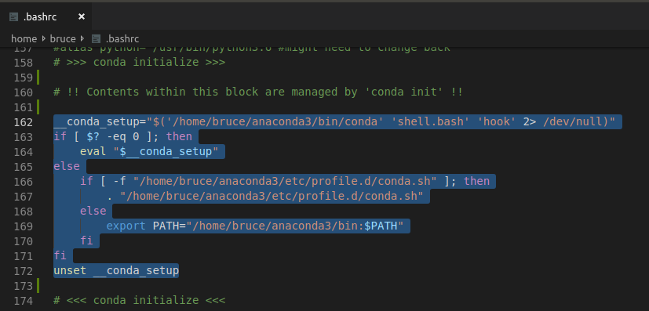
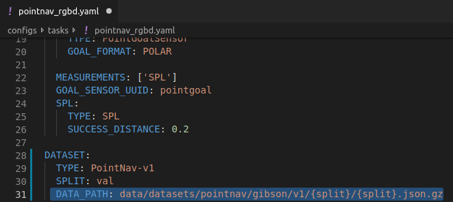
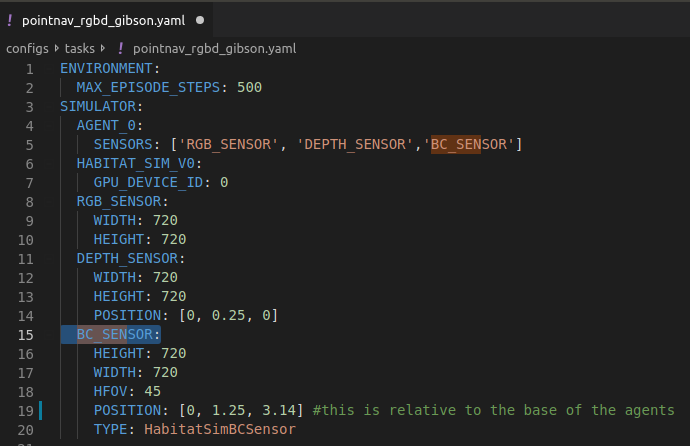

# Habitat ROS Interface

## Objective

Connect Facebook's AI Habitat simulator environment with ROS so that traditional ROS packages such as SLAM and navigation can be used.

## High Level Design


## Dependencies (Tested on Ubuntu 16.04 using ROS kinetic)

ROS Kinetic (http://wiki.ros.org/kinetic)

    *depthimage_to_laserscan
    *laser_scan_matcher
    *hector_slam [needed during mapping and navigation]

Anaconda (https://www.anaconda.com/distribution/) 


## Installation Procedures
1. Clone this repository into your catkin_ws/src folder
2. Run `cd ~/catkin_ws && catkin_make`(replace catkin_ws with your own workspace name if applicable)
3. Install ROS' depthimage_to_laserscan, laser_scan_matcher and hector_slam packages by running `sudo apt-get install ros-kinetic-depthimage-to-laserscan`,  `sudo apt-get install ros-kinetic-laser-scan-matcher`, and `sudo apt-get install ros-kinetic-hector-slam`. If you encounter erros relating to "cannot find package", this link helped me solve the problem https://answers.ros.org/question/325039/apt-update-fails-cannot-install-pkgs-key-not-working/
4. [Anaconda environment with python>=3.6 is needed for this step] Install habitat-api with instructions here  https://github.com/brucecui97/habitat-api, but DO NOT install habitat-sim using the links given in this repo. Instead, install habitat-sim by following this link https://github.com/brucecui97/habitat-sim/tree/lci2019s. Specifically, the "Developer installation and getting started" section. (Note you do not need to install these in a catkin workspace)
5. Resolve errors you encounter when installing habitat-api and habitat-sim by seeing their issues page in Facebook's repos first. (https://github.com/facebookresearch/habitat-api and https://github.com/facebookresearch/habitat-sim)

The following steps ensure you can run Anaconda along side ROS (we need Anaconda because Habitat requires python>=3.6 while ROS requires python2)

6. In the Anaconda environment you used to install habitat-api and habitat-sim, run `pip install rospkg` so the file habitat-api/habitat_ros/hab_ros_plant.py can be ran from your Python3.6 Anaconda environment
7. If your setup.bash files related to ROS is automatically being sourced by ~/.bashrc, remove that so you won't run into errors because of ROS adding "/opt/ros/kinetic/lib/python2.7/dist-packages" to your python path. (e.g. If you don't you would get the following error when importing cv2 in a Python3.6 Anaconda environment: "/opt/ros/kinetic/lib/python2.7/dist-packages/cv2.so: undefined symbol: PyCObject_Type". (more details about this issue can be found here: https://stackoverflow.com/questions/43019951/after-install-ros-kinetic-cannot-import-opencv)
8.  [Recommended] Add an alias to the sourcing commands of your ROS setup.bash files

The following picture shows how I modified my ~/.bashrc file to complete steps 8 and 9


### Installation Procedure Justifications
1. NA
2. NA
3. Normally ROS does not come with laser scan matcher package, which is needed for visual odometry
4. You need habitat api and habitat sim installed to run simulator back-end. The installation links point to my repos because this allows you to use the ROS interface directly with settings I preconfigured. Please note that the main difference between my forked habitat-api repo and the Facebook's habitat-api repo is that I added the habitat_ros folder and some task config .yaml files , which can easily be copy-pasted into Facebook's habitat-api repo. Similarly, I made no modifications to Facebook's habitat-sim repo, but only added a tag indicating the habitat-sim version I tested on
5. NA
6. This step installs a new rospkg in your anaconda environment since the one you installed with your ROS distribution is done using apt-get which installs to your system's default python directory, and not the Anaconda directory you installed Habitat in. After this step, you can use rospkg functionalities in your anaconda environment with python>=3.6. In short, this step ensures ROS works in an Anaconda environment with python>=3.6
7. This step allows you to not add ROS paths by default and only add the paths when you need ROS. 
8. This step allows you to add ROS required paths more easily

## Running Habitat with ROS

1. Activate your anaconda python>=3.6 and cd into habitat-api's root directory
2. Source your ROS related setup.bash files
3. cd into the habitat-api directory
4. Run `python habitat_ros/hab_ros_interface.py` to run the node that publishes on habitat sensor reading topics and subscribes to the /cmd_vel topics

5.  Deactivate Anaconda as you won't need python>=3.6 anymore to interact with the Habitat back-end (This step is hacky. I usually just go inside my ~/.bashrc and comment/uncomment the lines related to Anaconda manually depending on whether or not I need Anaconda)

     

6. close and re-open your terminal
7. Source your ROS related setup.bash files again and run `roslaunch habitat_interface default.launch` to convert all habitat sensor messages into ROS messages  (e.g.  numpy image to ROS image).  This launch file also launches a joystick controller to control the habitat agent along with visualization tools such as rviz, rqt_graph, and image view

Launch files for running hector_mapping (hector_map.launch) and navigation (move_base.launch) are also included. First run default.launch, then run either hector_map.launch or move_base.launch. Note that to run navigation, you need to change the value of the "map_path" variable in move_base.launch to point to the map you want to use. In addition, you can use the get_ros_map.py script in habitat-api/habitat_ros to generate a ROS/Rviz compatible map that you can compare/overlay with your SLAM generated map to evaluate the SLAM generated map's accuracy.


<!-- 
This launch file also ensure all of the custom habitat sensor topics are being converted to ROS topics (e.g. numpy image converted to ROS image). Most notably, there is a node in this launch file to convert a depth image into laser scan. -->
   
### Publish/subscribed topics by hab_ros_interface.py

Published:

 * /habitat/depth [rospy_tutorials/Floats]
 * /rosout [rosgraph_msgs/Log]
 * /habitat/rgb [rospy_tutorials/Floats] 
 * /depth_and_pointgoal [rospy_tutorials/Floats] 

Subscribed
* /cmd_vel [geometry_msgs/Twist]

 
### Modifying Habitat Simulator Settings

You can change simulator settings by modifying the hab_ros_interface.py file.

#### Changing Scenes

To change scenes, change the config file fed into the environment initializer in hab_ros_interface.py. 

```python
my_env = sim_env(env_config_file="path/to/your/custom/config/file.yaml")
```
Specifically, inside your config file, modify the DATASET tag. See screenshot below for an example



#### Changing Robot Dynamics

You can modify the _update_position and _update_attitude behaviours/methods in the sim_env class in hab_ros_interface.py to change the robot's behaviour at each time step. (e.g. you can specifiy that the robot has a maximum acceleration of 0.1m/s^2)

#### Changing Sensor Publishing Freuqency
Change the _sensor_rate class variable in hab_ros_interface.py

#### Changing number of sensors
See examples/register_new_sensors_and_measures.py for details. 

As an example, I added an additional sensor called BC_SENSOR (this is just another RGB sensor) and you can access the readings of this sensor if you add this sensor to your config file (see screenshot below as an example). You can obtain its values by calling `self.observations['bc_sensor']` in hab_ros_interface.py



```python
# # Custom BC SENSOR
#---------------------------------------------------------------------
_C.SIMULATOR.BC_SENSOR = SENSOR.clone()
_C.SIMULATOR.BC_SENSOR.TYPE = "HabitatSimBCSensor"
```


1. 

## Testing
TODO (Haibtat uses pytest, and currently I'm learning how to use pytest with ROS)

## Future work 

1. Place Habitat in a catkin work space (i.e. make Habitat a ROS package). The advantage of wrapping Habitat in a catkin_ws is that we can use launch files to remap topics and do unit and integration tests. The main difficulty of this implementation  is that most of habitat's files specify relative paths, while ROS commands such as rosrun and roslaunch sets "the working directory of all nodes to $ROS_HOME, which in most cases will be $HOME/.ros" (source: https://answers.ros.org/question/235337/unable-to-read-a-file-while-using-relative-path/)
 
    Therefore, to wrap habitat in a catkin_package, we either need to change all paths in habitat-api (possibly also habitat-sim) to be absolute paths, or need to somehow use ROS' `rospack find` feature (`$find some_package` feature in ROS launch files) to change all relative paths to absolute paths at run time.

    Below is an image showing a sample habitat episode specification file. You can see the path to the scene is relative to habitat-api's root directory.

    

2. Simplify the procedures to run Habitat with ROS. For example, eliminate the need to manually comment out lines in .bashrc to run system's default ROS. Currently I'm searching/developing a robust method to run ROS in a python2.7 Anaconda environment.

3. Improve multithreading implementation of hab_ros_interface.py to optimize for performance
4. Add unit tests and ROS node tests

